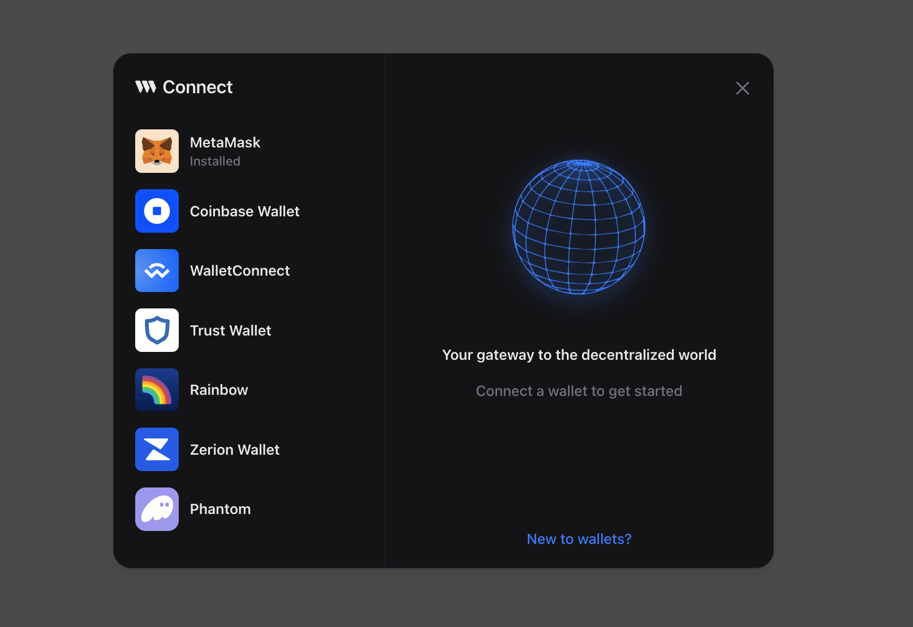

# XMTP PWA with Thirdweb Tutorial

### Installation

```bash
bun install
bun start
```

This tutorial will guide you through the process of creating an XMTP app with Thirdweb.

### Step 0: Setup

For thirdweb SDK to work as a fresh install you need to install this packages

```bash
npm install @thirdweb-dev/react "ethers@^5"
```

You also need to polyfill with multiple libraries. Copy paste this into your `packages.json`

```bash
"url": "latest",
"http": "npm:http-browserify",
"https": "npm:https-browserify",
"zlib": "npm:browserify-zlib",
"http-browserify": "latest",
"https-browserify": "latest",
"browserify-zlib": "latest",
"assert": "^2.0.0",
"stream": "^0.0.2"
```

### Step 1: Setup

First, you need to import the necessary libraries and components. In your `App.js` file, import the `ThirdwebProvider` from `@thirdweb-dev/react` and wrap your main component with it.

```jsx
import { ThirdwebProvider } from "@thirdweb-dev/react";
```

```jsx
<ThirdwebProvider
  authConfig={{
    authUrl: "/",
    domain: "http://localhost:3000/",
  }}
  activeChain="ethereum"
>
  <InboxPage />
</ThirdwebProvider>
```

### Step 2: Web3Button

Use the `Web3Button` hook to get the wallet modal button.



```jsx
{
  !signer && (
    <div style={styles.xmtpContainer}>
      <Web3Button action={() => login()}>Login</Web3Button>
    </div>
  );
}
{
  signer && (
    <FloatingInbox isPWA={isPWA} wallet={signer} onLogout={handleLogout} />
  );
}
```

### Step 3: XMTP Integration

In your component, use the `useSigner` hook from `@xmtp/react-sdk` to get the XMTP client.

```jsx
import { useSigner } from "@thirdweb-dev/react";
import { useClient } from "@xmtp/react-sdk";

//Thirdweb
const signer = useSigner();
//XMTP
const { client, error, isLoading, initialize } = useClient();
await initialize({ keys, options, signer });
```

### Step 4: Message Handling

In your `MessageContainer` component, use the `useMessages` and `useSendMessage` hooks from `@xmtp/react-sdk` to get the messages and send messages.

```jsx
const { messages, isLoading } = useMessages(conversation);
const { sendMessage } = useSendMessage();
```

### Step 5: Conversation Handling

In your ListConversations component, use the useConversations and useStreamConversations hooks from @xmtp/react-sdk to get the conversations and stream new conversations.

```jsx
const { conversations } = useConversations();
const { error } = useStreamConversations(onConversation);
```

That's it! You've now created an XMTP app with Thirdweb.
